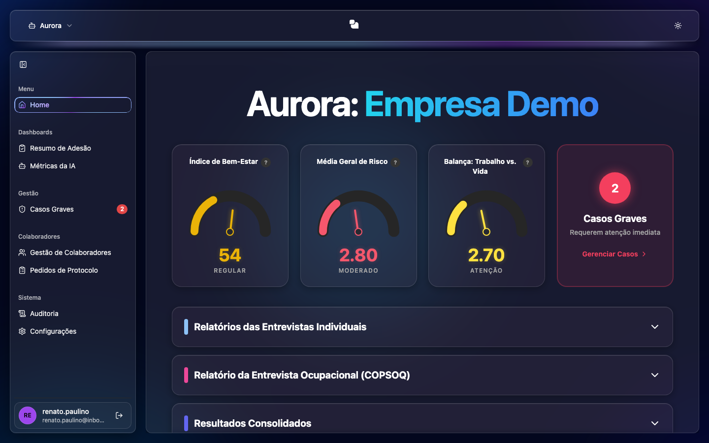

# Casos Graves

Tela para **identificar e dar tratamento** aos casos que requerem atenção imediata.

## O que você vê
- **Indicadores** (Bem-Estar, Risco, Balança) e o **card de Casos Graves**.
- Botão **Gerenciar Casos**, que abre o painel de gestão.

## Painel "Gerenciar Casos"
- **Filtro de Período**: Últimos 30 dias / Últimos 7 dias / Todo o histórico.
- **Indicadores (KPIs)**: Casos Graves Identificados, Aguardando Ação, Em Tratativa, Concluídos, Arquivados.
- **Gráficos**: status das tratativas e origem dos alertas.
- **Detalhamento por Paciente**: tabela com Colaborador/Evento, Nível de Risco, Último Alerta, Status e a ação **Gerenciar**.

## Tratativa de um caso
1. Na tabela, clique em **Gerenciar** na linha do colaborador.
2. No diálogo **Tratativa de Caso Grave**:
   - Defina o **Status da Tratativa** (Aberto, Em Andamento, Concluído, Arquivado).
   - Atribua um **Responsável**.
   - Registre andamentos no campo **Adicionar um comentário** e clique em **Comentar**.
3. O **Histórico & Comentários** mostra toda a linha do tempo do caso.
