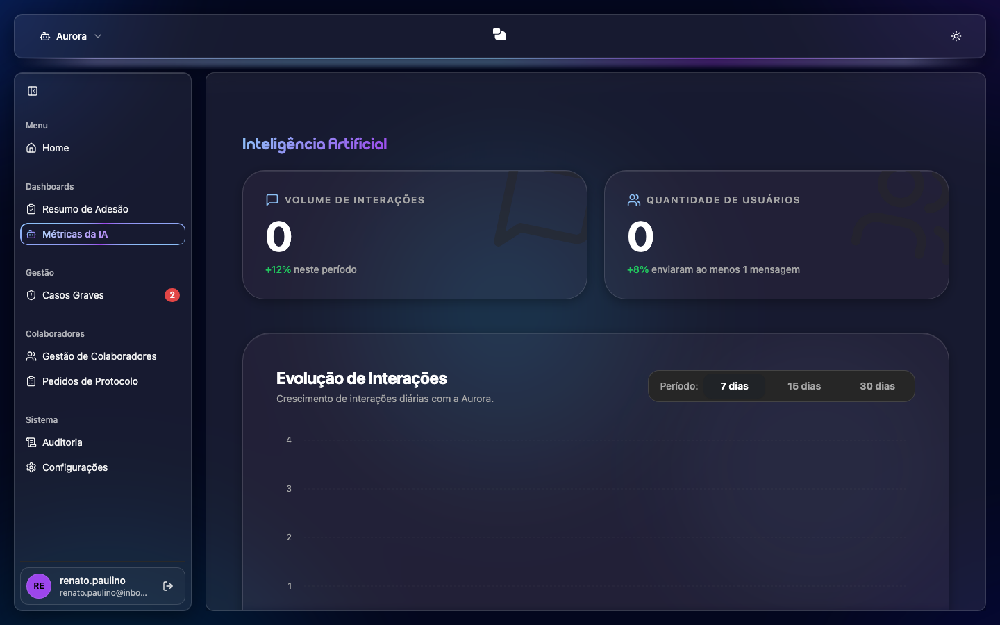

# Métricas da IA

Tela com o **uso do assistente de Inteligência Artificial** da Aurora.

## O que você vê
- **Volume de Interações**: total de interações no período.
- **Quantidade de Usuários**: quantas pessoas usaram o assistente.
- **Evolução de Interações**: gráfico de linha com a evolução ao longo do tempo.
- **Período**: alterne entre **7, 15 ou 30 dias**.

## Como usar
1. Escolha o **período** desejado.
2. Acompanhe os indicadores e o gráfico de evolução.
3. Passe o mouse sobre o gráfico para ver os valores de cada ponto.
