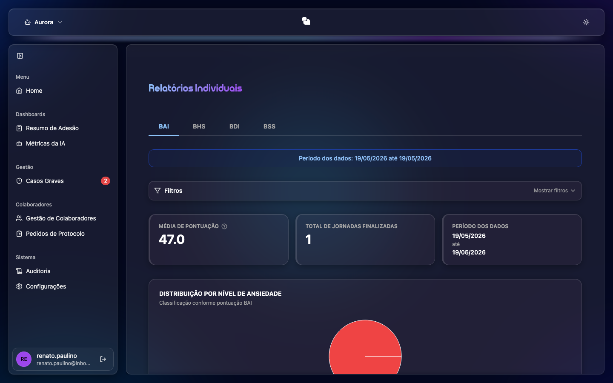

# Relatórios Individuais (BAI, BHS, BDI, BSS)

Relatórios das **entrevistas individuais** por protocolo de avaliação.

## Protocolos (abas)
- **BAI** — Ansiedade
- **BHS** — Desesperança
- **BSS** — Ideação Suicida
- **BDI** — Depressão

Use as **abas no topo** para alternar entre os protocolos.

## O que cada relatório mostra
- **Período** dos dados.
- **Distribuição por Nível** (quantos colaboradores em cada faixa).
- **Perfil dos Respondentes** (gênero, faixa etária, escolaridade, ocupação, área, estado civil).
- **Casos Moderados e Graves — Análise Detalhada**.
- **Análise por Pergunta** (média/severidade item a item).

## Como usar
1. Clique na **aba** do protocolo desejado.
2. Role a página para ver cada seção do relatório.
