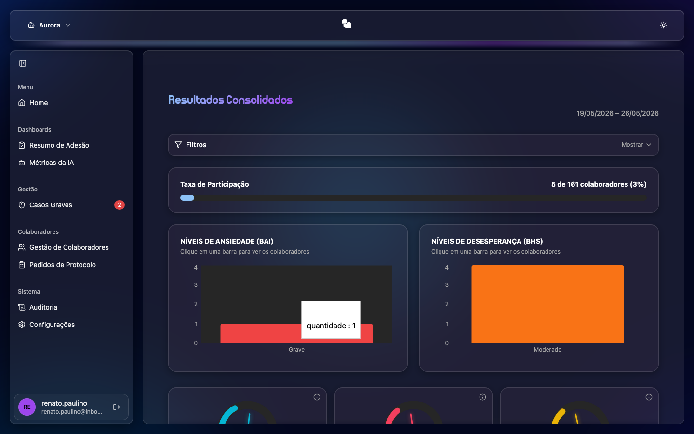

# Resultados Consolidados

Visão **consolidada** que reúne os principais resultados num só lugar.

## O que você vê
- **Período** dos dados.
- **Taxa de Participação** (quantos colaboradores responderam, com percentual).
- **Níveis por protocolo** (BAI, BHS) em gráficos.
- **Indicadores** (Bem-Estar, Risco, Balança).
- **Casos Graves** identificados.
- **Resultados Individuais**: tabela com Colaborador, Protocolo, Score e Nível.
- **Exportar CSV**: baixa a tabela de resultados.

## Como usar
1. Acesse pelo acordeão **Resultados Consolidados** na Home.
2. Use **Exportar CSV** para levar os dados para análise externa.
